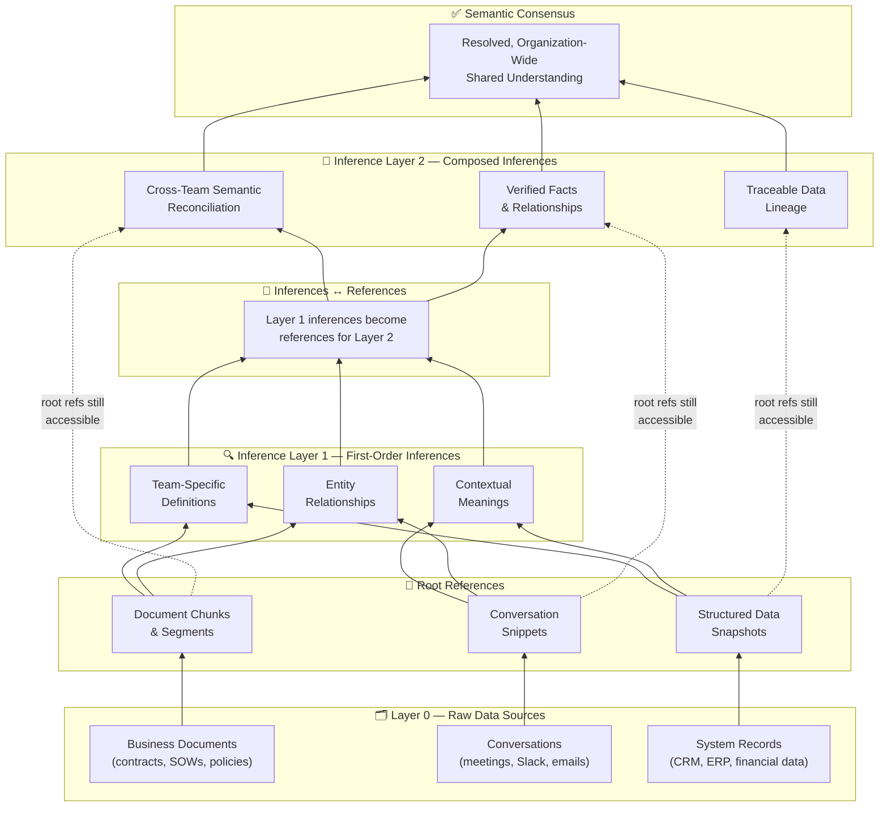

Everybody is talking about AI: AI agents and systems everywhere. I see people using terms like tokenmaxxing and Claudemaxxing. The agentic AI world has taken everybody by storm, and people are calling 2026-27 the year for the ChatGPT 3.5 moment of agents.

But not so fast - there is a hidden problem that comes up, one that slows down every enterprise and any sort of AI adoption across any organization or institution.

## The backdrop

Before we dive in, we should know about how AI systems fundamentally work nowadays.

At a very high level, AI systems work on RAG, which stands for Retrieval Augmented Generation. The flow is, from a high level, very simple. Before you actually ask an LLM or prompt an LLM, you also inject data into the LLM while the prompt is being sent or just before it's being sent. In this way, what exactly happens is that the LLM actually references the information that you have given to it, prioritizing it over information that it has already been trained on. Accordingly, it gives you the answer for that.

This is extremely useful when it's about personalization or contextual understanding across your institutional data. You can call it analogous to what you do in software engineering when you use a database instead of hard-coding every variable inside the application itself.

## The current approach to institutional context

The current way that gives the biggest return on investment to businesses is the ontological approach, wherein you map all business relationships (as in attributes, items, and all data points) across your entire organization in the form of a graph. A graph, by nature, is very intuitive, as it has arrows to point out the relationship between entities, and on top of that, arrows you can actually visualize what sort of relationship they really have. That basically makes graphs the best choice for AI agents to operate on business data. The approach to building these graphs is called [ontology](https://www.palantir.com/platforms/ontology).

This is exactly what Palantir operationalizes at scale to US governments and to all big corporations across the U.S. and beyond. They have forward-deployed engineers (or FDEs, a term they actually coined). These FDEs get embedded within the engineering teams of all of their clients and operationalize their entire operating business models, interactions and context into one organization-wide knowledge graph for Palantir's AI platform (AIP), which contains AI agents and workflows that use AI that consume the information and the connected data points on this knowledge graph itself. This forms the fundamental basis of their [layer 2](https://www.palantir.com/docs/foundry/ontology), which powers all workflows and their integrations on their proprietary Foundry/AIP platform.

These cost a lot for initial setup, but as per every client that Palantir has had, these have given them massive multipliers in their initial upfront investment. They have established Palantir as the go-to company for all sorts of data operations and business intelligence across U.S. mega-companies, as well as the U.S. government.

## The problem hiding in plain sight

But here's the problem: English or any other natural language that we speak of - is not SQL, as in you cannot have one word only meaning one thing in different contexts.

**And that's where the problem starts - the moment you decide to move from a shiny demo to an actually full-blown, robust working AI system.**

## From demo to production: the unseen hurdle

Imagine a scenario where a top executive is in a meeting with multiple teams. Just for an example, let's consider an all-hands meeting wherein a CxO comes in and asks, "Okay, what has been the revenue for us so far?"
- The Sales Lead responds, "We have booked around $3M in revenue."
- The GTM guy says, "3? We are talking about 5 here."
- The Account Executive says, "Well, it's $2M according to me."
- Your CFO says, "Wait, we are still at $500K."

### What happened exactly?

Well, it turns out that the word "revenue" means different things for different teams in different contexts. For example:
1. Revenue means contracted values (contracted ARR or CARR or whatever you call it) for sales folks.
2. For GTM folks, it's about the potential pipeline.
3. For account executives, it's about the contract and value of contracted deals closed.
4. For the CFO, it's the actual money that hits the bank.

Congratulations! You just understood what not having semantic consensus does to any organization. Now apply that 10,000x faster, and you get what not having contextual semantic consensus does to your AI systems across your organization.

## Okay, tell me more

You store a lot of organizational data, as in conversations, business documents, etc., to feed to your AI, and that is not something that you can fit in rows and columns, as in tables. That's what we call unstructured data, and it also consists of natural language, which is its most common form.

So, the biggest hurdle to actually get any value out of your business data is the semantic consensus, and it turns out that it's not a problem of only language itself. It is also a problem in your AI systems, that actually assume semantic consensus in natural language is fundamentally baked in by design (just like SQL), which is not the case as we saw in the example above.

## The looming problem...

Well, here you got an example wherein semantic consensus did not exist from the start, and that is arguably easier to identify and (maybe) fix. What about the bigger problem wherein the semantic consensus did exist at one point, but then there has been a drift and it does not exist anymore? Or worse, it exists partially - where in each word or each term or relationship can mean the same thing for a few teams, but not across all teams in your organization?

This phenomenon is what you call Semantic Drift (also called "Context Rot"), wherein you had consensus over time and now that consensus does not exist anymore or exists partially, which is an even more subtle problem to identify but can be potentially a business killer. This mirrors exactly what data engineers in the data world, who work with structured data, call Data Drift. Everyone is very well aware of how serious data drift is - it can actually kill businesses - ask [**Zillow**](https://www.deeplearning.ai/the-batch/price-prediction-turns-perilous).

If structured data (that can be monitored and is monitored so well in organizations) can almost kill a business as big as Zillow due to data (and consequentially AI drift) - imagine what "Semantic Drift" can cause to your organization. And ontologies, by default, are very brittle and sensitive to Semantic Drift, and can radically impact how AI agents perform.

## How does Palantir do (and maintain) Semantic Consensus then?

Well, it's completely manual in nature. That's what an entire team of FDEs have to cover it up as a workaround. The problem is rooted in the way that organizational knowledge graphs are by design. It doesn't just require better organizational ontologies, but a total reimagination of organizational knowledge graphs as well. It also begets a deeper question:

> Were ontologies ever really the solution?

The points are clear:
1. Ontologies store static snapshots of your operational intelligence and only augment the entities, attributes, and relationships between them. They don't enable you to question the structure and the assumptions on which these entities and relationships were created.
2. It causes you monitoring failures, and there is little to no way to actually understand when your Semantic Drift actually starts.
3. Semantic drift must be eliminated at the outset itself. Otherwise, it can cascade across all of your business operations.

I have been working on this exact question for the past three years. What I have found is that agents fundamentally view the world differently from us because:
1. Agents assume the presence of semantic consensus by design, unlike us humans who can actually perceive the difference.
2. Agents are designed to trust organizational knowledge graphs as the sole single source of truth for their entire world interpretation for task completion. Humans do not.
3. This makes AI agents fundamentally very susceptible to Semantic drift.

In fact, I've actually touched upon the consequences [in a previous article to this series](/blog/build-a-company-brain#:~:text=Ontologies%20and%20knowledge%20graphs%20that%20span) as well.

## The potential path forward

This is where it really gets interesting. If even manual approaches are not trustworthy, then what is the way to go forward? This has been one of the things that has kept me up at night.

This is what I have seen actually works:

1. Agents will be creating their own context and updating them accordingly.
2. These contexts would be of two types:
- References, which contain actual snippets or chunks or segments of unstructured and semi-structured data across all of your business data sources.
- Inferences, which will actually be inferences from across all of your references layer.

Now here's where it gets interesting: inferences from the previous layer can also act as references for the next layer, like lego blocks that can be put on top of each other. What does that mean? Let's say you start with your business documents and conversation logs.

1. From documents, chunks become your source and root reference. Root reference means you can actually refer to this in your data, and from there, across all of these root references, you create the inference layer 1, which AI models can actually infer as a background job on the go.
2. From there, the inferences from layer one and the references from layer zero can act as references for inferences in layer two, which will contain inference and facts.

Here is a visual depiction of how it works (please switch to light mode in case you cannot see the arrows):

This enables you to create hierarchical, tractable inferences on the fly, rooted back to a certain reference. This also enables you to understand what data lineage really looks like structurally, by design.

That's what I've been building at Alchemyst, to varying degrees of success, across all of our customers. Dollar for dollar, this fundamental shift has enabled us to deliver more value than what Palantir Foundry and AIP platform do - [**you can see for yourself**](https://agentyic.com/case-studies). Nothing beats the happiness when actually a client reads through all of their changes and the value that we bring to them, and it delivers a smile on their face.

